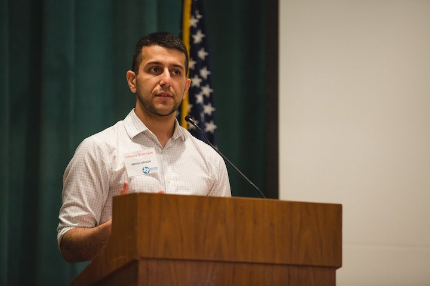

If you're reading this, welcome to my new blog! This is my very first post on `[object Object]`, a blog about JavaScript and the web.

I began this project with the hope of sharing knowledge that I gain throughout my career, gaining insight and feedback on my writing and my code, and improving my writing skills. With some luck, I will also make a friend or two along the way. Without further ado, let me introduce myself...

## About me

My name is **Mehdi Vasigh**, and I am a Software Developer currently based out of Houston, TX. I have been building with JavaScript in various shapes and forms for over 4 years, though I have only recently begun to do so full-time. I enjoy building full-stack JavaScript applications with the help of Node.js, Express, and React, and most recently I've taken an interest in GraphQL.

I've been a graphic and web designer far longer than I've been programming, and I am a GeoCities child. Outside of my editor, I like to explore Houston's [amazing](https://www.google.com/maps/place/El+Paraiso+Mexican+Restaurant/@29.7482438,-95.3921086,17z/data=!3m1!4b1!4m5!3m4!1s0x8640bf60a2e6e181:0x78d593c58a5a5ffe!8m2!3d29.7482438!4d-95.3899199) [food](https://www.eatlola.com/) and [coffee,](https://m.facebook.com/blackhole.coffeehouse/) travel, and get sucked into Wikipedia black holes. [Say hi on Twitter!](https://twitter.com/intent/tweet?screen_name=mehdi_vasigh)

## About [object Object]

More than anything, this project is a way for me to keep a journal of things that I learn and problems that I solve throughout my career. Here are some of the topics I will be writing about...

### JavaScript

No surprise here! JavaScript is my bread and butter programming language, and our love-hate relationship will be a theme of this blog. Expect nifty JS techniques, common pitfalls, cool libraries and projects, and various browser APIs to fill up the majority of the content here.

### CSS techniques and UI/UX

Occasionally I expect to cover CSS techniques and approaches to building specific UI patterns using CSS. I am also slightly late to the CSS Grid party, so expect Grid-related content as I continue to learn it. Once in a while, I may write about some platform-agnostic UI/UX topics.

### Career-related and soft skills

I probably will not be spending as much time on this, as there are a ton of other amazing resources out there for this kind of content and I mostly want this to be a technical journal of sorts, but every once in a while I may be inspired to write on one of these kinds of topics.

### ...your topic of choice!

Want me to write about a specific topic? [Drop me a line on Twitter](https://twitter.com/intent/tweet?screen_name=mehdi_vasigh) and I'll add it to my list (provided I can put together a coherent blog post about it, that is).

... and that's about it. Not the most interesting first post in the world, but we all start somewhere. Thanks for reading!
